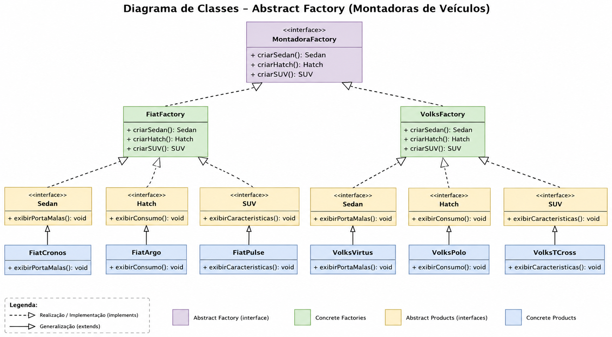

# 🚗 Padrões de Projeto — Veículos

Projeto desenvolvido em **Java** com **Java Swing** para demonstrar, na prática, a aplicação dos padrões de projeto **Factory Method** e **Abstract Factory**.

---

## 👩‍💻 Integrantes

* **Mariana Ocireu**
* **Rebeca Matewanga**

---
# 📊 Diagrama de Classes



---

## 📚 Sobre o Projeto

O projeto simula a criação de diferentes tipos de veículos utilizando padrões de projeto criacionais.

A atividade foi dividida em três partes:

* **Parte 1:** Implementação do padrão **Factory Method**;
* **Parte 2:** Implementação do padrão **Abstract Factory**;
* **Parte 3:** Expansão das fábricas para suportar um novo tipo de veículo: **SUV**.

Além da implementação dos padrões, foi utilizada uma interface gráfica desenvolvida com **Java Swing** para permitir a interação com o sistema.

---

# 🏭 Parte 1 — Factory Method

Na primeira parte, foi implementado o padrão **Factory Method** para criação de veículos.

Foi criada a interface:

```text
Veiculo
```

com o método:

```java
void exibirDetalhes();
```

### 🚘 Produtos Concretos

Foram implementados dois produtos:

* 🚗 `Carro`
* 🏍️ `Moto`

Ambos implementam a interface `Veiculo`.

### 🏭 Factory

Foi criada a classe:

```text
VeiculoFactory
```

responsável por criar os objetos de acordo com o tipo informado:

```java
Veiculo criarVeiculo(String tipo);
```

Quando o tipo informado é:

* `CARRO` → retorna uma instância de `Carro`;
* `MOTO` → retorna uma instância de `Moto`.

Dessa forma, a classe cliente `Main` não precisa utilizar diretamente:

```java
new Carro();
```

ou

```java
new Moto();
```

A criação dos objetos fica centralizada na fábrica.

### 📁 Estrutura do Factory Method

```text
factorymethod
│
├── Carro.java
├── Main.java
├── Moto.java
├── Veiculo.java
└── VeiculoFactory.java
```

---

# 🏢 Parte 2 — Abstract Factory

Na segunda parte, foi utilizado o padrão **Abstract Factory** para representar famílias de veículos de diferentes montadoras.

Foram definidos três tipos de produtos:

### 📦 Produtos Abstratos

```text
Sedan
Hatch
SUV
```

Cada interface representa um tipo de veículo e define seus respectivos comportamentos.

### 🚘 Família Fiat

A família Fiat é composta por:

* `FiatCronos` → Sedan
* `FiatArgo` → Hatch
* `FiatPulse` → SUV

A criação desses produtos é realizada pela:

```text
FiatFactory
```

### 🚙 Família Volkswagen

A família Volkswagen é composta por:

* `VolksVirtus` → Sedan
* `VolksPolo` → Hatch
* `VolksTCross` → SUV

A criação desses produtos é realizada pela:

```text
VolksFactory
```

### 🏭 Abstract Factory

A interface:

```text
MontadoraFactory
```

define os métodos responsáveis pela criação dos produtos de cada família:

```java
Sedan criarSedan();

Hatch criarHatch();

SUV criarSUV();
```

---

# 🚙 Parte 3 — Adicionando SUVs

Na terceira parte da atividade, o sistema precisou ser adaptado para atender a uma nova necessidade do mercado: **todas as montadoras deveriam produzir SUVs**.

Para isso, foi criada a nova interface:

```text
SUV
```

e adicionados os seguintes produtos:

### 🇮🇹 Fiat

```text
FiatPulse
```

### 🇩🇪 Volkswagen

```text
VolksTCross
```

As fábricas também foram adaptadas para criar os novos produtos:

```text
FiatFactory
VolksFactory
```

Essa etapa demonstra como o padrão **Abstract Factory** pode ser utilizado para organizar famílias de produtos relacionados e permitir a evolução do sistema.

---

## 🏭 Abstract Factory

O diagrama abaixo representa as principais relações entre a `MontadoraFactory`, suas fábricas concretas e os produtos das famílias Fiat e Volkswagen.


---

# 🗂️ Estrutura do Projeto

```text
PadrõesProjetoVeiculos
│
├── Source Packages
│   │
│   ├── abstractfactory
│   │   ├── FiatArgo.java
│   │   ├── FiatCronos.java
│   │   ├── FiatFactory.java
│   │   ├── FiatPulse.java
│   │   ├── Hatch.java
│   │   ├── Main.java
│   │   ├── MontadoraFactory.java
│   │   ├── SUV.java
│   │   ├── Sedan.java
│   │   ├── VolksFactory.java
│   │   ├── VolksPolo.java
│   │   ├── VolksTCross.java
│   │   └── VolksVirtus.java
│   │
│   ├── factorymethod
│   │   ├── Carro.java
│   │   ├── Main.java
│   │   ├── Moto.java
│   │   ├── Veiculo.java
│   │   └── VeiculoFactory.java
│   │
│   └── padroesprojetoveiculos
│       └── PadroesProjetoVeiculos.java
```

---

# 🧩 Padrões Utilizados

| Padrão               | Aplicação                                      |
| -------------------- | ---------------------------------------------- |
| **Factory Method**   | Criação de `Carro` e `Moto`                    |
| **Abstract Factory** | Criação de famílias de veículos das montadoras |
| **Java Swing**       | Interface gráfica para interação com o sistema |

---

# 🎯 Objetivos da Atividade

Com o desenvolvimento deste projeto, foi possível praticar:

* Implementação de interfaces em Java;
* Criação e utilização de fábricas;
* Aplicação do padrão **Factory Method**;
* Aplicação do padrão **Abstract Factory**;
* Organização de produtos em famílias;
* Uso de polimorfismo;
* Separação entre criação e utilização dos objetos;
* Extensão de um sistema existente com um novo tipo de produto;
* Desenvolvimento de interfaces gráficas utilizando **Java Swing**;
* Representação das relações entre classes utilizando **UML**.

---

# 💻 Tecnologias Utilizadas

* ☕ **Java**
* 🖥️ **Java Swing**
* 📐 **UML**
* 🏭 **Factory Method**
* 🏢 **Abstract Factory**
* 💻 **NetBeans IDE**


